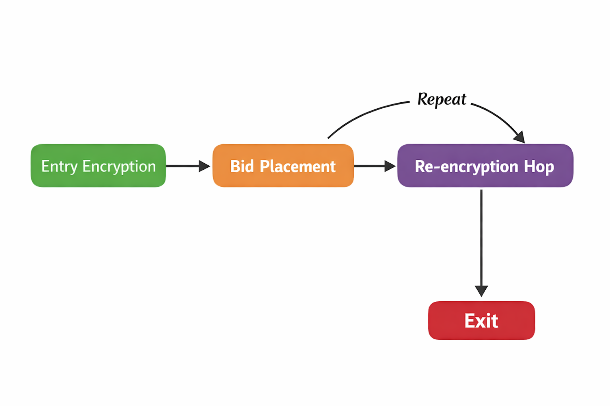

<!-- 
Copyright (C) 2025 Logical Mechanism LLC
SPDX-License-Identifier: CC-BY-4.0
-->
---
title: "The PEACE Protocol\\thanks{This project was funded in Fund 14 of Project Catalyst.}"
subtitle: "A protocol for transferable encryption rights."
author: "Logical Mechanism LLC\\thanks{Contact: support@logicalmechanism.io}"
date: \today
lang: en-US
documentclass: article
classoption: titlepage
fontsize: 11pt
papersize: letter
geometry:
  - margin=1in
  - heightrounded
numbersections: true
secnumdepth: 3
toc: true
toc-depth: 2
toc-title: Contents
colorlinks: true
links-as-notes: false
link-citations: true
urlcolor: MidnightBlue
linkcolor: MidnightBlue
citecolor: MidnightBlue
bibliography: refs.bib
csl: ieee.csl
reference-section-title: Bibliography
keywords:
  - encryption
  - decentralized systems
  - re-encryption
  - ECIES
  - AES-GCM
rights: © 2025 Logical Mechanism LLC. All rights reserved.
header-includes:
  - \usepackage{fancyhdr}
  - \usepackage{amsmath,amssymb,amsthm}
  - \newtheorem{lemma}{Lemma}
  - \numberwithin{lemma}{section}
  - \numberwithin{equation}{section}
  - \usepackage{etoolbox}
  - \usepackage[dvipsnames]{xcolor}
  - \usepackage[ruled,vlined,linesnumbered]{algorithm2e}
  - \AtBeginDocument{\pagenumbering{gobble}}
  - \AtBeginDocument{\hypersetup{pdfinfo={/Copyright=(© 2025 Logical Mechanism LLC. All rights reserved.)}}}
  - \usepackage{listings}
  - \usepackage{xcolor}
  - \usepackage{float}
  - \usepackage{placeins}
  - |
    \lstdefinestyle{python}{
      language=Python,
      basicstyle=\ttfamily\small,
      keywordstyle=\color{MidnightBlue},
      commentstyle=\color{Gray},
      stringstyle=\color{OliveGreen},
      numbers=left,
      numberstyle=\tiny,
      breaklines=true,
      frame=single,
      captionpos=b
    }
  - |
    \lstdefinelanguage{Aiken}{
      keywords={pub,type,fn,let,expect, const},
      sensitive=true,
      comment=[l]{//},
      morestring=[b]",
    }
  - |
    \lstdefinestyle{rust}{
      language=Aiken,
      basicstyle=\ttfamily\small,
      keywordstyle=\color{MidnightBlue},
      commentstyle=\color{Gray},
      stringstyle=\color{OliveGreen},
      numbers=left,
      numberstyle=\tiny,
      stepnumber=1,
      breaklines=true,
      frame=single,
      tabsize=2,
      captionpos=b
    }
---


\setlength{\parindent}{0pt}
\setlength{\parskip}{6pt}
\setlength{\emergencystretch}{3em}
\clubpenalty=10000
\widowpenalty=10000
\interfootnotelinepenalty=10000

\clearpage
\pagenumbering{arabic}
\pagestyle{fancy}
\fancyhf{}
\fancyfoot[C]{\footnotesize \today}

# Abstract

In this report, we introduce the PEACE protocol, an ECIES-based, multi-hop, unidirectional proxy re-encryption scheme for the Cardano blockchain. PEACE solves the encrypted-NFT problem by providing a decentralized, open-source protocol for transferable encryption rights, enabling creators, collectors, and developers to manage encrypted NFTs without relying on centralized decryption services. This work fills a significant gap in secure, private access to NFTs on Cardano. Project Catalyst[^fund] funded the PEACE protocol in round 14.

[^fund]: https://projectcatalyst.io/funds/14/cardano-use-cases-concepts/decentralized-on-chain-data-encryption

# Introduction

The encrypted NFT problem refers to the lack of inherent encryption and security measures for the digital assets, making the associated content vulnerable to unauthorized access, duplication, and loss, and is one of the most significant issues with current NFT standards on Cardano. Either the data is not encrypted, available to everyone who views the NFT, or the encryption requires centralization, with a company handling it on behalf of users. Current solutions [@stuffio-whitepaper] claim to offer decentralized encrypted assets (DEAs), but lack a publicly available, verifiable cryptographic protocol or an open-source implementation. Most, if not all, of the mechanics behind current DEA solutions remain undisclosed. This report aims to fill that knowledge gap by providing an open-source implementation of a decentralized re-encryption protocol for encrypted assets on Cardano.

Several mandatory requirements must be satisfied for the protocol to function as intended. The encryption protocol must allow tradability of both the NFT itself and the right to decrypt the NFT data, implying that the solution must involve smart contracts and a form of encryption that allows data access to be re-encrypted for another user without revealing the encrypted content in the process. The contract side of the protocol should be reasonably straightforward. It needs a way to trade a token that holds the encrypted data and allows other users to receive it. To ensure decryptability, the tokens must be soulbound. On the encryption side of the protocol is some form of encryption that enables the re-encryption process to function correctly. Luckily, this type of encryption has been in cryptography research for quite some time [@mambo-okamoto-1997] [@blaze-bleumer-strauss-1998] [@ateniese-et-al-ndss2005]. There are even patented cloud-based solutions already in existence [@ironcore-recrypt-rs]. Currently, there are no open-source, fully on-chain, decentralized re-encryption protocols for encrypting NFT data on Cardano. The PEACE protocol aims to provide a proof-of-concept solution to this problem.

The PEACE protocol will implement an ambitious yet well-defined, unidirectional, multi-hop proxy re-encryption (PRE) scheme [@WangCao2009PREPoster] that utilizes ECIES [@ieee-1363a-2004] and AES [@fips-197]. Unidirectionality means that Alice can re-encrypt for Bob, and Bob can then re-encrypt it back to Alice, using different encryption keys. Unidirectionality is important for tradability, as it defines the one-way flow of data and removes any restriction on who can purchase the NFT. Multi-hop means that the flow of encrypted data from Alice to Bob to Carol, and so on, does not end, in the sense that it cannot be re-encrypted for a new user. Multi-hopping is important for tradability, as a finitely tradable asset does not fit many use cases. Typically, an asset should always be tradable if the user wants to trade it. The encryption primitives used in the protocol are considered industry standards at the time of this report.

The remainder of this report is as follows. Section 3 discusses the preliminaries and background required for this project. Section 4 will be a brief overview of the required cryptographic primitives. Section 5 will be a detailed description of the protocol. Section 6 will delve into security and threat analysis, the protocol's limitations, and related topics. The goal of this report is to serve as a comprehensive reference and description of the PEACE protocol.

# Background And Preliminaries

Understanding the protocol will require some technical knowledge of modern cryptographic methods, a basic understanding of elliptic curve arithmetic, and a general understanding of how smart contracts work on the Cardano blockchain. Anyone comfortable with these topics will find this report very useful and easy to follow. The report will attempt to use research standards for terminology and notation. The elliptic curve used in this protocol will be BLS12-381 [@bowe-bls12-381-2017]. Aiken is used to write all smart contracts required for the protocol [@AikenCompiler].

Table: Symbol Description [@elmrabet-joye-2017]

| Symbol | Description |
|:-----:|-------------|
| $n$ | The order of $E(\mathbb{F}_{p})$ |
| $r$ | A prime number dividing $n$ |
| $\delta$ | A non-zero integer in $\mathbb{Z}_{n}$ |
| $\mathbb{G}_{1}$ | A subgroup of order $r$ of $E(\mathbb{F}_{p})$ |
| $\mathbb{G}_{2}$ | A subgroup of order $r$ of the twist $E'(\mathbb{F}_{p^{2}})$ |
| $\mathbb{G}_{T}$ | The multiplicative target group of the pairing: $\mu_r \subset \mathbb{F}_{p^{12}}^{\*}$ |
| $e: \mathbb{G}_{1} \times \mathbb{G}_{2} \to \mathbb{G}_{T}$ | A type-3 bilinear pairing |
| $g$ | A fixed generator in $\mathbb{G}_{1}$ |
| $q$ | A fixed generator in $\mathbb{G}_{2}$ |
| $R$ | The Fiat-Shamir transformer |
| $H$ | A hash function |
| $m$ | The order of Ed25519 |
| $\gamma$ | A non-zero integer in $\mathbb{Z}_{m}$ |

The protocol, including both on-chain and off-chain components, will heavily utilize the \texttt{Register} type shown in Listing \ref{lst:registertype}. The \texttt{Register} stores a generator, $g \in \mathbb{G}_{\kappa}$ and the corresponding public value $u = [\delta]g$ where $\delta \in \mathbb{Z}_{n}$ is a secret. We shall assume that the hardness of ECDLP and CDH in $\mathbb{G}_{1}$ will result in the inability to recover the secret $\delta$. When using a pairing, we additionally rely on the standard bilinear Diffie-Hellman assumptions over the subgroups $( \ \mathbb{G}_{1}, \mathbb{G}_{2}, \mathbb{G}_{T}\ )$. We will represent the groups $\mathbb{G}_{1}$ and $\mathbb{G}_{2}$ with additive notation and $\mathbb{G}_{T}$ with multiplicative notation.

Where required, we will verify Ed25519 signatures [@rfc8032] for cost-minimization, as relying solely on pure BLS12-381 for simple signatures becomes too costly on-chain. There will be instances where the Fiat-Shamir transform [@fiat-shamir-1986] will be applied to a $\Sigma$-protocol to transform it into a non-interactive variant. In these cases, the hash function will be Blake2b-224 [@rfc7693].

# Cryptographic Primitives Overview

This section provides brief explanations of the cryptographic primitives required by the protocol. If a primitive has an algorithmic description, then it will be included in the respective sub-section. We will represent the \texttt{Register} type as a tuple,$\ ($ $g, u\ )$, for simplicity inside the algorithms. We shall assume that the compression and uncompression of the elliptic curve points are canonical and follow the Zcash implementation [@ZcashProtocolSpec2022NU5]. Correctness proofs for many algorithms are in Appendix B.

## Register-based

The protocol requires proving knowledge of a user's secret using a Schnorr $\Sigma$-protocol [@thaler-pazk-2022] [@schnorr1991]. This algorithm is both complete and zero-knowledge. We can use simple Ed25519 signatures for spendability, and then utilize the Schnorr $\Sigma$-protocol for knowledge proofs related to encryption. We will make the protocol non-interacting via the Fiat-Shamir transform, R, as shown in Listing \ref{lst:fiatshamir}.

\begin{algorithm}[H]
\caption{Non-interactive Schnorr's $\Sigma$-protocol for the discrete logarithm relation}
\label{alg:schnorrsig}

\KwIn{\\ $\ ($ $g, u\ )$ where $g \in \mathbb{G}_{\kappa}$, $u=[\delta]g \in \mathbb{G}_{\kappa}$}
\KwOut{\textsf{bool}}

select a random $\delta' \in \mathbb{Z}_{n}$

compute $a = [\delta']g$

calculate $c = R(g, u, a)$

compute $z = \delta*c + \delta'$

output $[z]g = a + [c]u$
\end{algorithm}

The protocol requires proving a binding relationship between a user's public value and other known elliptic-curve elements. The binding proof is a combination of multiple Schnorr's $\ Sigma$-protocols. The value $\chi$ is the $\mathbb{G}_{1}$ element of the second term in the encryption level, specifically, \texttt{r2.g1b}.

\begin{algorithm}[H]
\caption{Non-interactive Binding $\Sigma$-protocol}
\label{alg:bindingsig}

\KwIn{
  \\ $\ ($ $g, u\ )$ where $g \in \mathbb{G}_{1}$, $u=[\delta]g \in \mathbb{G}_{1}$ \\
  $(r_{1}, \chi)$ where $r_{1} \in \mathbb{G}_{1}$, $\chi \in \mathbb{G}_{1}$ \\
  $(a, r)$ where $a \in \mathbb{Z}_{n}$ and $r \in \mathbb{Z}_{n}$
}
\KwOut{\textsf{bool}}

select a random $\rho \in \mathbb{Z}_{n}$ and $\alpha \in \mathbb{Z}_{n}$ 

compute $t_{1} = [\rho]g$

compute $t_{2} = [\alpha]g + [\rho]u$

calculate $c = R(g, u, t_{1}, t_{2})$

compute $z_{a} = a*c + \alpha$

compute $z_{r} = r*c + \rho$

output $[z_{a}]g + [z_{r}]u = t_{2} + [c]\chi \land [z_{r}]g = t_{1} + [c]r_{1}$
\end{algorithm}

There will be times when the protocol requires proving some equality using pairings. In these cases, we can use something akin to the BLS signature scheme, allowing only someone with the knowledge of the secret to prove the pairing equivalence. BLS signatures are a straightforward yet important signature scheme for the protocol, as they enable public confirmation of knowledge of a complex relationship beyond the limitations of Schnorr's $\Sigma$-protocols. BLS signatures work because of the bilinearity of the pairing [@Menezes1993ECPKC].

\begin{algorithm}[H]
\caption{Boneh-Lynn-Shacham (BLS) signature method}
\label{alg:blssig}

\KwIn{\\$\ ($ $g, u, c, w, m\ )$ where $g \in \mathbb{G}_1$, $u=[\delta]g \in \mathbb{G}_1$, \\ $c = p^{H(m)} \in \mathbb{G}_2$, $w = [\delta]c \in \mathbb{G}_2$, and $m\in\{0,1\}^{*}$}
\KwOut{\textsf{bool}}

$e(u, c) = e(g, w)$

$e(q^{\delta}, c) = e(q, c^{\delta})$

\end{algorithm}


## ECIES + AES-GCM

The Elliptic Curve Integrated Encryption Scheme (ECIES) is a hybrid protocol involving asymmetric cryptography with symmetric ciphers. The encryption used in ECIES is the Advanced Encryption Standard (AES). ECIES and AES, combined with a key derivation function (KDF) such as HKDF [@cryptoeprint:2010/264], form a complete encryption system. Below is a simple ECIES algorithm to demonstrate the basic functionality. For readability, we present a simplified ECIES sketch here. The reference implementation provides the exact PEACE instantiation and serialization rules.

\begin{algorithm}[H]
\caption{Encryption using ECIES + AES}
\label{alg:encrypt-eciesaes}

\KwIn{\\$\ ($ $g, u\ )$ where $g \in \mathbb{G}_{\kappa}$, $u=[\delta]g \in \mathbb{G}_{\kappa}$, $m \in \{0,1\}^{*}$}
\KwOut{$\ ($ $r, c, h\ )$ }

select a random $\delta' \in \mathbb{Z}_{n}$

compute $r = [\delta']g$

compute $s = [\delta']u$

generate $k = KDF(s | r)$

encrypt $c = AES(m, k)$

compute $h = BLAKE2B(m)$

output $\ ($ $r, c, h\ )$

\end{algorithm}

Decrypting the ciphertext requires rebuilding the data encryption key (DEK), $k$, from the KDF. The DEK is rebuildable because $r$ is public and the user knows the secret $\delta$, allowing them to decrypt the data.

\begin{algorithm}[H]
\caption{Decryption using ECIES + AES}
\label{alg:decrypt-eciesaes}

\KwIn{\\$\ ($ $g, u\ )$ where $g \in \mathbb{G}_1$, $u=[\delta]g \in \mathbb{G}_1$,\\$\ ($ $r, c, h\ )$ as the capsule}
\KwOut{$\ ($ $\{0,1\}^{*}$,\textsf{bool} $\ )$ }

compute $s' = [\delta]r$

generate $k' = KDF(s' | r)$

compute $m' = AES(c, k')$

compute $h' = BLAKE2B(m')$

output $\ ($ $m'$, h' = h $\ )$

\end{algorithm}

Algorithm \ref{alg:encrypt-eciesaes} describes the case where a \texttt{Register} is used to generate the DEK from the KDF function. Anyone with knowledge of $k$ may decrypt the ciphertext. The algorithm shown differs slightly from the PEACE protocol's implementation, as the protocol allows transferring the DEK to another \texttt{Register}; however, the general flow remains the same. The key takeaway here is that encrypting a message and decrypting the resulting ciphertext require a key to generate the DEK. Both algorithms \ref{alg:encrypt-eciesaes} and \ref{alg:decrypt-eciesaes} use a simple hash function for authentication. In the PEACE protocol, we will use AES-GCM with authenticated encryption with associated data (AEAD) for authentication.

## Re-Encryption

There are various types of re-encryption schemes, ranging from classical proxy re-encryption (PRE) to hybrid methods. These re-encryption schemes involve a proxy, an entity that performs both re-encryption and verification. The PRE used in the PEACE protocol is modeled as an interactive flow between the current owner and a prospective buyer, utilizing a smart contract as part of the proxy. We need an interactive scheme because, in many real-world use cases, numerous off-chain checks, such as KYC/AML regulations and various legal requirements, must occur before transferring the right to decrypt on-chain to the new owner. The PEACE protocol obtains interactivity via a bidding system that requires the current owner to agree to the exchange.

The method described below is a hybrid approach. The current owner's wallet performs the re-encryption process for the buyer. At the same time, the Cardano smart contract acts as a proxy, verifying various cryptographic proofs, enforcing the correct bindings, handling payments, and updating the on-chain owner fields. This design explicitly supports off-chain processes before the transfer of decryption rights. The current owner only submits the re-encryption transaction once these off-chain conditions are satisfied. This method will support the broadest range of real-world asset use cases. The PRE is unidirectional, meaning the re-encryption flow is one-way: from the current owner to the next owner. If Alice delegates to Bob, Bob does not automatically gain the ability to 'go backwards' and create ciphertexts for Alice using the same re-encryption material. This flow differs from a bidirectional method, where the PRE is symmetric, enabling a two-way encryption relationship between the parties, meaning Alice can transform a ciphertext into one for Bob, and Bob can transform a ciphertext into one for Alice, without either Alice or Bob having to re-run the entire re-encryption flow. That is not what we want for this implementation. Each direction is a separate, explicit transfer of rights with its own re-encryption material, meeting the protocol's tradability requirements.

Note that in the original Catalyst proposal, the protocol defines itself as a bidirectional, multi-hop PRE. However, during the design phase, it became clear that the actual Cardano use case requires a unidirectional, multi-hop PRE. This change is fully compatible with the original proposal's PRE goals (transfer of decryption rights without exposing plaintext or private keys), but reflects the reality of trading tokens via Cardano smart contracts within the PRE landscape.

\begin{algorithm}[H]
\caption{Owner-mediated re-encryption from Alice to Bob}
\label{alg:reencrypt-alice-bob}

\KwIn{
  \\
  $(g, u)$ where $g \in \mathbb{G}_1$, $u = [\delta_{a}]g \in \mathbb{G}_1$ (Alice's public key),\\
  $(g, v)$ where $v = [\delta_{b}]g \in \mathbb{G}_1$ (Bob's public keys),\\
 Alice's secret key $\delta_{a} \in \mathbb{Z}_n$\\
  $p \in \mathbb{G}_2$\\
  $(r_{1,a}, r_{2,a}, r_{3,a})$, where $r_{1} \in \mathbb{G}_1$, $r_{2} \in \mathbb{G}_{T}$, and  $r_{3} \in \mathbb{G}_2$\\
  $(h_{0}, h_{1}, h_{2})$, where $h_{i} \in \mathbb{G}_2$ are fixed public points.
}
\KwOut{
  $(r_{1,b}, r_{2,b}, r_{3,b})$ and $(r_{1,a}', r_{2,a}', r_{3,a}')$
}

\BlankLine

select a random $a \in \mathbb{Z}_{n}$

compute $\kappa = e(q^{a}, h_{0})$

select a random $r \in \mathbb{Z}_{n}$

compute $r_{1,b} = [r]g$

compute $r_{2,b} = e(q^{a}, h_{0}) * e(v^{r}, h_{0}) = e(q^{a}v^{r}, h_{0})$

compute $c = [BLAKE2b(r_{1,b})]h_{1} + [BLAKE2b(r_{1,b} || r_{2,b})]h_{2}$

compute $r_{4,b} = [r]c$

compute $r_{5,b} = [BLAKE2b(\kappa)]p + [\delta_{a}]h_{0}$

update $r_{2,a}' = r_{2,a} * e(r_{1,a}, r_{5,b})$

output $(r_{1,b}, r_{2,b}, r_{4,b})$ and $(r_{1,a}, r_{2,a}', r_{3,a})$

\end{algorithm}


Algorithm \ref{alg:reencrypt-alice-bob} describes the actual re-encryption process for Alice, resulting in the transfer of the decryption rights to Bob. Bob can then use this information to recursively calculate the secret $\kappa$ and eventually the original secret used in the encryption process.

# Protocol Overview

The PEACE protocol is an ECIES-based, multi-hop, unidirectional proxy re-encryption scheme for the Cardano blockchain, allowing creators, collectors, and developers to trade encrypted NFTs without relying on centralized decryption services. The protocol should be viewed as a proof-of-concept, as the data storage layer is the Cardano blockchain. The current Cardano chain parameters bind the storage limit. In a production setting, the data storage layer should allow for arbitrary file sizes.

{ width=40% float=true }


## Design Goals And Requirements

Two equally important areas, the on-chain and off-chain, define the protocol design. The on-chain design is everything related to smart contracts written in Aiken for the Cardano blockchain. The off-chain design includes transaction construction, cryptographic proof generation, and the happy-path flow. The design on both sides will focus on a two-party system: Alice and Bob, who want to trade encrypted data. Alice will be the original owner, and Bob will be the new owner. As this is a proof-of-concept, the off-chain will not include the general n-party system, as that is future work for a real-world production setting.

The protocol must allow continuous trading via a multi-hop PRE, meaning that Alice trades with Bob, who can then trade with Carol. In this setting, Alice will trade to Bob, then Bob will trade back to Alice, rather than Carol, without any loss of generality. Each hop will generate a new owner and decryption data for the encryption UTxO. The storage of previous encryption levels should grow at most linearly. Users will use a basic bid system for token trading. A user may choose not to trade their token by simply not selecting a bid if one exists.

The re-encryption process needs to flow in one direction per hop. Alice trades with Bob, and that is the end of their transaction. Bob does not gain the ability to re-encrypt the data back to Alice without a new bid from Alice, which restarts the re-encryption process. Any bidirectionality here implies symmetry between Alice and Bob, thereby circumventing the re-encryption requirement via token trading. The unidirectional requirement forces tradability to follow the typical trading interactions currently found on the Cardano blockchain.

Each UTxO in this system must be uniquely identified via an NFT. The uniqueness requirement works well for the encryption side because the NFT could be a tokenized representation of the encrypted data, something akin to a CIP68 [@CIP-68] contract, but using a single token. The bid side does work, but the token becomes a pointer rather than having any real data attached, essentially a unique, one-time-use token. Together, they provide the correct uniqueness requirement. UTxOs may be removed from the contract at any time by the owner. After the trade, the owner of the encrypted data may do whatever they want with that data. The protocol does not require the re-encryption contract to permanently store the encrypted data.

The protocol will use an owner-mediated re-encryption flow (a hybrid PRE), which is UX-equivalent to a classical proxy re-encryption scheme in this setting, since smart contracts on Cardano are passive validators and do not initiate actions. Ultimately, some user must act as the proxy, the one doing the re-encryption, because the contract cannot do it on its own. The smart contract must act as the proxy's validator, not solely as the proxy itself. To simplify this proof-of-concept implementation, the owner will act as their own proxy in the protocol.

## On-Chain And Off-Chain Architecture

There will be two user-focused smart contracts: one for re-encryption and the other for bid management. Any UTxO inside the re-encryption contract is for sale via the bidding system. A user may place a bid into the bid contract, and the current owner of the encrypted data may select it as payment for re-encrypting the data to the new owner. To ensure functionality, a reference data contract must exist, as it resolves circular dependencies. The reference datum will contain the script hashes for the re-encryption and bid contracts.

The bid contract datum structure is shown in Listing \ref{lst:biddatumtype}. The bid datum contains all of the required information for re-encryption. The owner of a bid UTxO will be type \texttt{Register} in $\mathbb{G}_{1}$. The \texttt{pointer} is the NFT name on the bid UTxO, and \texttt{token} is the NFT name on the re-encryption UTxO. The \texttt{token} forces the bid to only apply to a specific sale.

The bid contract redeemer structures are shown in Listing \ref{lst:bidredeemertypes}. Entering into the bid contract uses the \texttt{EntryBidMint} redeemer, triggering a \texttt{pointer} mint validation, a \texttt{token} UTxO existence check, an Ed25519 signature with \texttt{owner\_vkh}, and a Schnorr $\Sigma$-protocol using \texttt{owner\_g1}. Leaving the bid contract requires using \texttt{RemoveBid} and \texttt{LeaveBidBurn} redeemers together, triggering a \texttt{pointer} burn validation and Ed25519 signature with \texttt{owner\_vkh}. When a user selects a bid, they will use \texttt{UseBid} and \texttt{LeaveBidBurn} together, triggering a \texttt{pointer} burn validation and the proxy re-encryption validation.

Listing \ref{lst:encdatumtype} shows the re-encryption contract datum structure. The ciphertext and related data are in the \texttt{Capsule} subtype, and each hop generates a new encryption-level subtype. We cannot store or do arithmetic on $\mathbb{G}_{T}$ elements on-chain, and storing extra group elements is expensive. So \texttt{EmbeddedGt} stores only the minimal factors needed to reconstruct the $\mathbb{G}_{T}$ elements during validation. The user may reference any required constants.

The re-encryption datum contains all of the required information for decryption. The owner of the re-encryption UTxO will be type \texttt{Register} in $\mathbb{G}_{1}$. The \texttt{token} is the NFT name on the re-encryption UTxO. The \texttt{Capsule} contains the encryption information, and \texttt{levels} contains the decryption information. Inside the \texttt{capsule} is the \texttt{nonce}, \texttt{aad}, and \texttt{ct}.

The re-encryption contract redeemer structures are shown in Listing \ref{lst:encredeemertypes}. Entering into the re-encryption contract uses the \texttt{EntryEncryptionMint} redeemer, triggering a \texttt{token} mint validation, an Ed25519 signature with \texttt{owner\_vkh}, a binding proof using \texttt{owner\_g1}, and a Schnorr $\Sigma$-protocol using \texttt{owner\_g1}. Leaving the re-encryption contract requires using both \texttt{RemoveEncryption} and \texttt{LeaveEncryptionBurn} redeemers, triggering a \texttt{token} burn validation and an Ed25519 signature with \texttt{owner\_vkh}. When a user selects a bid, they use the \texttt{UseEncryption} redeemer, which triggers proxy re-encryption validation.

The redeemers \texttt{UseEncryption}, \texttt{UseBid}, and \texttt{LeaveBidBurn} must be used together during re-encryption.

## Key Management And Identity

Each user in the protocol can deterministically generate BLS12-381 key pairs represented by \texttt{Register} value in $\mathbb{G}_{1}$. The $\mathbb{G}_{1}$ points are the user's on-chain identity for encryption and signature verification. The corresponding secret scalar, $\delta \in \mathbb{Z}_n$, is held off-chain by the user's wallet or client software and never published on-chain.

The BLS12-381 keys used for re-encryption are logically separate from the Ed25519 keys used to sign Cardano transactions. A wallet must manage both Ed25519 keys for authorizing UTxO spending and BLS12-381 scalars for obtaining and delegating decryption rights. Losing or compromising the BLS12-381 secret key means losing the ability to decrypt any items associated with that identity, even if the Cardano spending keys are still available.

The proof-of-concept does not implement a full key rotation or revocation mechanism. If a user's BLS12-381 secret key is compromised, an attacker can decrypt all current and future capsules addressed to that key, but cannot retroactively remove or alter on-chain history. Handling key rotation, partial recovery, and revocation across many encrypted positions is left as future work for a real-world production deployment.

For each encrypted item, the protocol generates a fresh KEM used at the  \texttt{EncryptionLevel}. The KEM is never directly stored on-chain. The on-chain Capsule contains the AES-GCM nonce, associated data, and ciphertext.

## Protocol Specification

### Phase 1: Creating The Encryption UTxO

The protocol flow starts with Alice selecting a secret $[\gamma] \in \mathbb{Z}_{m}$ and $[\delta] \in \mathbb{Z}_{n}$. The secret $\gamma$ will generate an Ed25519 keypair. The secret $\delta$ will generate the \texttt{Register} in $\mathbb{G}_{1}$ using the fixed generator, $g$. Alice will fund the address associated with the \texttt{VerificationKeyHash}, the \texttt{vkh}, with enough Lovelace to pay for the minimum required Lovelace for the contract UTxO, the change UTxO, and the transaction fee. Alice may then build the re-encryption entry transaction.

The re-encryption entry transaction will contain a single input and two outputs. The transaction will mint a \texttt{token} using the \texttt{EntryEncryptionMint} redeemer. The \texttt{token} name is generated by the concatenation of the input's output index and transaction ID, as shown in the Listing \ref{lst:gentkn}. The protocol specification assumes a single input, but this transaction may use multiple inputs. If more than one input exists, then the first element of a lexicographically sorted input list will be used for the name generation.

Alice may now finish building the \texttt{EncryptionDatum} by constructing the \texttt{levels} and \texttt{capsule} fields. Since Alice is the first owner, she will encrypt it for herself. Alice will encrypt the original data by generating a root secret $\kappa_{0} \in \mathbb{G}_{T}$. The root secret, $\kappa_{0}$, will be used in the KDF to produce a valid DEK. The message will be encrypted using AES-GCM. The  \texttt{Capsule} type will store the resulting information. Listing \ref{lst:first-level} is a Pythonic pseudocode for generating the original encrypted data and the first encryption level. The sub-types of the \texttt{EncryptionDatum} can be populated as shown in Listing \ref{lst:actualfirstlevel}. The contract will validate the first encryption level using the assertion from Listing \ref{lst:validatefirstlevel}. Alice can prove to herself that the encryption level is valid by verifying the assertion in Listing \ref{lst:decryptfirstlevel}. Alice may now construct the full \texttt{EncryptionDatum} as shown in Listing \ref{lst:fullfirstdatum}.

The entry redeemer verifies that Alice's \texttt{owner\_vkh} is valid via an Ed25519 signature, since Alice needs a valid \texttt{vkh} to remove the entry. The entry redeemer also verifies a valid \texttt{Register} via a Schnorr $\Sigma$-protocol as shown in Algorithm \ref{alg:schnorrsig}. Alice needs this to decrypt her own data and to verify that she binds her public value to the first encryption level via a binding proof, as shown in Algorithm \ref{alg:bindingsig}. The encrypted data is ready to be traded after successfully creating a valid entry transaction and submitting it to the Cardano blockchain.

### Phase 2: Creating The Bid UTxO

Bob may now place a bid in the bid contract to purchase the encrypted data from Alice. First, Bob selects a secret $[\gamma] \in \mathbb{Z}_{m}$ and $[\delta] \in \mathbb{Z}_{n}$. Similarly to Alice, the secret $\gamma$ will generate an Ed25519 keypair and the secret $\delta$ will generate the \texttt{Register} in $\mathbb{G}_{1}$ using the fixed generator, $g$. Bob will fund the address associated with his \texttt{vkh} with enough Lovelace to pay for payment, the change UTxO, and the transaction fee. Bob may then build the bid entry transaction. Note that the protocol grows the encryption datum linearly in size with each additional encryption level, so the required Lovelace for a given encrypted message will increase over time. Bob should contribute to the minimum required Lovelace for the encrypted data, though this is not required on-chain.

The structure of the bid entry transaction is similar to that of the re-encryption entry transaction, but uses \texttt{EntryBidMint} instead of \texttt{EntryEncryptionMint}. The transaction input derives the \texttt{pointer} token name in the same way as the \texttt{token} name. A user may reference the \texttt{token} name on-chain from the re-encryption contract. Bob may then create the \texttt{BidDatum} as shown in Listing \ref{lst:fullbiddatum}.

Similar to the re-encryption contract, the entry redeemer will verify Bob's \texttt{vkh} and the \texttt{Register} values in $\mathbb{G}_{1}$. A valid \texttt{Register} is important, as the validity of the $\mathbb{G}_{1}$ point determines whether Bob can decrypt the data after the re-encryption process. The value on the UTxO is the price Bob is willing to pay for Alice to re-encrypt the data to his \texttt{Register}. There may be many bids, but Alice may only select a single bid for the re-encryption transaction. For simplicity of the proof-of-concept, Bob will need to remove his old or unused bids, then recreate the bids for any necessary price or \texttt{token} adjustments. Bob may remove his bid at any time.

### Phase 3: Bid Selection And Re-Encryption

Alice will select a bid UTxO from the bid contract and re-encrypt it using Bob's \texttt{Register} data. This step requires Alice to burn Bob's bid token, update the on-chain data to Bob's data, and create the re-encryption proofs. The re-encryption is the most important step of the protocol, as it involves trading both the token and the encrypted data. The re-encryption redeemer will provide all of the required proxy validation proofs. The PRE proofs demonstrate that the values produced by the re-encryption process match the expected values via pairings involving the original owner's \texttt{Register}, the new owner's \texttt{Register}, and the next encryption level. Everything is consistent, resulting in a transfer of ownership and decryption rights. Listing \ref{lst:createnextlevel} is a Pythonic pseudocode for generating the next encryption level. Bob's and Alice's encryption levels are shown in Listing \ref{lst:encryptionlevels}. The complete next encryption datum is shown in Listing \ref{lst:nextencryptiondatum}.

The contract will validate the re-encryption using a binding proof and two pairing proofs as shown in Listing \ref{lst:validatereencryption}. The first assertion follows Alice's first-level validation, ensuring that the encryption level terms are consistent. The second assertion shows that Alice correctly created the $r_{5}$ term. Adding a SNARK for valid witness creation is left as future work for a real-world production deployment, as it is out of scope for the proof-of-concept implementation. The SNARK will need to prove that the secret $\kappa$ truly does the witness when you hash it, $W = q^{H(\kappa)}$

### Phase 4: Decryption

Bob can now decrypt the root key by recursively computing all the random $\mathbb{G}_{T}$ points as shown in Listing \ref{lst:decrypting}.

# Security Model

The PEACE protocol needs to have reasonable security. In a real-world production setting, the protocol has a minimal attack surface. As a proof-of-concept, the protocol needs additional security to be production-grade.

## Assumptions

This protocol is presented as a proof-of-concept and inherits standard assumptions from public-key cryptography and public blockchains. The assumptions below describe what must hold for the security claims in this document to be meaningful.

- All compressed curve points accepted by the protocol (on-chain or off-chain) MUST be validated as canonical encodings. As members of the correct prime-order subgroup (rejecting non-canonical encodings, the point at infinity where disallowed, and any point not in the intended subgroup), otherwise an attacker may exploit small-subgroup/cofactor edge cases to bypass security claims or forge relations that appear to verify.

- Cryptographic assumptions hold: The security of the construction relies on standard hardness assumptions for the chosen primitives (pairing groups / discrete log), collision resistance and preimage resistance of the hash functions used (including domain separation), and unforgeability of any signature schemes used.

- Correct domain separation: All hashes used for hashing-to-scalar, Fiat–Shamir transcripts, and key derivations use fixed domain tags and unambiguous encodings. A domain-separation bug is a critical security failure.

- Well-formed randomness: All secret scalars and nonces are sampled with high entropy and never reused where uniqueness is required. Randomness failures (poor RNG, nonce reuse, low-entropy secrets) are catastrophic.

- Endpoint key safety: Alice's and Bob's long-term secret keys remain confidential. The extraction of keys from the wallet/device provides confidentiality and authenticity guarantees for parties that do not hold them.

- On-chain validation is authoritative: The ledger enforces the validator exactly as written (Aiken/Plutus semantics). Any check performed only off-chain is advisory and not part of the security boundary.

- Proof system assumptions: In a production setting, the protocol must use SNARKs. Their required assumptions hold (soundness and any additional properties needed for adversarial settings). If the SNARK requires a trusted setup, then the corresponding trapdoor ("toxic waste") is assumed destroyed.

- Chain security: The blockchain provides finality and censorship-resistance to the degree commonly assumed for Cardano. Prolonged reorgs, validator bugs, or sustained censorship are out of scope.

- Scope boundary: The protocol does not assume (and does not attempt to enforce) that the plaintext has any particular meaning or quality, nor does it assume Bob will keep plaintext private after decryption.

## Trust Model

The protocol design minimizes trust between Alice and Bob. The smart contract is the source of truth for what constitutes a valid re-encryption hop. Anything not enforced by the on-chain validator is advisory. We do not assume Alice or Bob is honest. Either party may attempt to cheat, submit malformed data, or abort mid-protocol. The proxy is at best semi-trusted: it may be offline, malicious, or compromised. Any compromised keys are a severe failure. We assume standard cryptographic hardness of the underlying primitives (pairings / discrete log, hash collision resistance, and signature unforgeability), and we assume the wallet or OS will protect endpoint key material. A compromise of long-term keys (Alice/Bob/etc) is out of scope except where explicitly mitigated (e.g., domain separation and on-chain binding checks).

## Threat Analysis

**Adversary capabilities**

- Full network observer: can read all on-chain data, replay transactions, and correlate timing/amount patterns.

- Active attacker: can submit arbitrary transactions, craft malformed ciphertext/proofs, and attempt to use validator failures/success as an oracle.

- Insider attacker: Alice or Bob may act maliciously (sell garbage, withhold finalization, attempt to claim funds without delivering the correct re-encryption).

- Key compromise: theft of a participant's secret keys is possible.

**Primary threats and mitigations**

- Invalid re-encryption accepted on-chain: mitigated by strict on-chain validation that binds ciphertext components, public keys, and transcript hashes to the expected relations.

- Related-ciphertext / CCA-style probing: mitigated by making ciphertexts and re-encryption steps non-malleable under the on-chain checks (proofs must bind all relevant fields so "tweaks" are rejected).

- Multi-hop bypass: if downstream decryption reveals intermediate artifacts used to decrypt upstream ciphertexts without the proxy, it breaks the intended delegation boundary; mitigation is hop-level re-randomization / re-encapsulation and careful design to ensure decryption yields only plaintext (not reusable upstream capabilities). 

- Fairness failure (abort/grief): either party can stop cooperating; mitigations are economic and protocol flow design, not cryptography alone.

## Metadata Leakage

The protocol runs on a public UTxO ledger, so metadata leakage is unavoidable.

**Potential leakage includes:**

- Transaction graph linkage: repeated verification keys, registers, UTxO patterns, and timing can link multiple protocol runs to the same actors or workflow.

- Protocol fingerprinting: ciphertext sizes, hop count, and datum/redeemer structure can reveal which step the protocol is in and correlate participants across transactions.

- Value and timing leakage: amounts, fees, and time between steps can reveal trade size, urgency, and repeated counterparties.

- Key/identity linkage via commitments: even with hashed values, fixed-format commitments and domain tags can still be fingerprinted if reused or if inputs have low entropy.

**Mitigations are partial and operational:**

- Rotate addresses and avoid stable identifiers where possible

- Treat privacy as a separate layer (mixing, batching, relayers) rather than something the core protocol guarantees.

## Limitations And Risks

- The proof-of-concept protocol does not include a SNARK that proves the published $H(\kappa)$-dependent terms are derived from the actual pairing secret $\kappa = e(q^{a_{0}}, H_{0})$. Algebraic pairing and Schnorr checks only enforce consistency with some exponent. A malicious Alice can choose an arbitrary $H(\kappa)$ and still pass on-chain validation even when the hash is incorrect. A production-grade design should add a ZK proof over a canonical encoding that enforces $hk = H(e(q^{a_{0}}, H_{0}))$ and $W = q^{hk}$ without revealing $\kappa$ or $a_{0}$.

- The protocol can prove key-binding and correct re-encryption relations, but it cannot prove that the encrypted content is "valuable" or matches an off-chain description. Disputes about semantics require external mechanisms.

- The protocol does not protect the data after decryption. If Bob decrypts the plaintext, Bob can copy or leak it. Cryptography cannot prevent exfiltration. Only economic or legal controls can reduce this risk.

- The protocol does not ensure a fair exchange. Either party can abort or grief at different stages. Achieving strong fairness typically requires escrow, bonding, or timeouts.

- Key compromise is catastrophic. Any theft of secret keys compromises the confidentiality of those assets. Losing secret keys prevents decrypting.

- The proof-of-concept protocol does not guarantee CCA security. If any proof field can be modified while still passing on-chain checks, then an attacker may use acceptance/rejection or decryption behavior as an oracle.

- The protocol does not limit hops directly. The Cardano blockchain limits the size of UTxO, thereby naturally limiting the maximum number of hops.

- Pairing-heavy verification and SNARK verification can approach the CPU budget, requiring multi-transaction validation flows, increasing complexity, and can reduce UX reliability under network congestion.

## Performance And On-Chain Cost

The re-encryption process performs excellently. The generation of the proofs is quick. The encryption setup is easy. The PRE flow is simple. The cost of running the re-encryption validation leans towards the expensive side. The Schnorr and binding proofs are relatively cheap, but the pairing proofs are expensive. A single pairing proof costs almost 15% of the total cpu budget per transaction. In a real-world production setting, the re-encryption step may max out the cpu budget completely because of the SNARK requirement. In that case, the re-encryption validation may need to be broken up into multiple transactions such that the cpu budget per transaction remains low enough to be valid on-chain.

# Conclusion

The PEACE protocol is a multi-use, unidirectional PRE for the Cardano blockchain with reasonable security guarantees. As a proof of concept, PEACE emphasizes correctness, composability, and an auditable trust boundary. The current design still requires a scoped trust assumption in the re-encryption behavior by the current owner, and we treat this as an engineering constraint rather than an unresolved ambiguity. The protocol limitations vanish by integrating a zero-knowledge proof of correct re-encryption in a future revision. We highlight the realities of the UTxO model, metadata leakage, and on-chain resource limits, and show how the design keeps cryptographic enforcement feasible while preserving a clear path toward stronger privacy and robustness. PEACE provides a concrete foundation for encrypted-asset markets on Cardano. It shows what is possible on-chain, what should remain off-chain, and how ownership can evolve across multiple hops while preserving decryption continuity for the rightful holder.

\clearpage
\appendix

# Appendix A - Listings {#app:types}

```{=latex}
\begin{lstlisting}[
  style=rust,
  caption={The Register type},
  label={lst:registertype}
]
pub type Register {
  // the generator, #<Bls12_381, G1> or #<Bls12_381, G2> 
  generator: ByteArray,
  // the public value, #<Bls12_381, G1> or #<Bls12_381, G2> 
  public_value: ByteArray,
}
\end{lstlisting}
```

```{=latex}
\begin{lstlisting}[
  style=rust,
  caption={The Bid datum type},
  label={lst:biddatumtype}
]
pub type BidDatum {
  owner_vkh: VerificationKeyHash,
  owner_g1: Register,
  pointer: AssetName,
  token: AssetName,
}
\end{lstlisting}
```

```{=latex}
\begin{lstlisting}[
  style=rust,
  caption={The Bid redeemer types},
  label={lst:bidredeemertypes}
]
pub type BidMintRedeemer {
  EntryBidMint(SchnorrProof)
  LeaveBidBurn(AssetName)
}
pub type BidSpendRedeemer {
  RemoveBid
  UseBid
}
pub type SchnorrProof {
  z_b: ByteArray,
  g_r_b: ByteArray,
}
\end{lstlisting}
```

```{=latex}
\begin{lstlisting}[
  style=rust,
  caption={The Encryption datum type},
  label={lst:encdatumtype},
  float
]
pub type EncryptionDatum {
  owner_vkh: VerificationKeyHash,
  owner_g1: Register,
  token: AssetName,
  levels: List<EncryptionLevel>,
  capsule: Capsule,
}
pub type Capsule {
  nonce: ByteArray,
  aad: ByteArray,
  ct: ByteArray,
}
pub type EncryptionLevel {
  r1b: ByteArray,
  r2: EmbeddedGt,
  r4b: ByteArray,
}
pub type EmbeddedGt {
  g1b: ByteArray,
  g2b: Option<ByteArray>,
}
\end{lstlisting}
```

```{=latex}
\begin{lstlisting}[
  style=rust,
  caption={The Encryption redeemer types},
  label={lst:encredeemertypes},
  float
]
pub type EncryptionMintRedeemer {
  EntryEncryptionMint(SchnorrProof, BindingProof)
  LeaveEncryptionBurn(AssetName)
}
pub type EncryptionSpendRedeemer {
  RemoveEncryption
  UseEncryption(ByteArray, ByteArray, AssetName, BindingProof)
}
pub type BindingProof {
  z_a_b: ByteArray,
  z_r_b: ByteArray,
  t_1_b: ByteArray,
  t_2_b: ByteArray,
}
\end{lstlisting}
```

```{=latex}
\begin{lstlisting}[
  style=rust,
  caption={Token name generation},
  label={lst:gentkn},
  float
]
/// Example Usage:
///
/// input:
/// 1234567890abcdef1234567890abcdef1234567890abcdef1234567890abcdef#24
///
/// token_name:
/// 181234567890abcdef1234567890abcdef1234567890abcdef1234567890abcd
///
pub fn generate_token_name(inputs: List<Input>) -> AssetName {
  let input: Input = builtin.head_list(inputs)
  let id: TransactionId = input.output_reference.transaction_id
  let idx: Int = input.output_reference.output_index
  id |> bytearray.push(idx) |> bytearray.slice(0, 31)
}
\end{lstlisting}
```


```{=latex}
\begin{lstlisting}[style=python, caption={Creating the Encrypted data and first encryption level}, label={lst:first-level}, float, floatplacement=H]

message = "This is a secret message."

# generate random data for the first encryption level
a0 = rng()
r0 = rng()
k0 = random_fq12(a0)

# alice as a register, sk is the secret key
alice = Register(sk)

# generate the r terms
r1b = scale(g, r0)
r2_g1b = scale(g, a0 + r0*sk)

a = to_int(blake2b(r1b))
b = to_int(blake2b(r1b + r2_g1b))

c = combine(combine(scale(H1, a), scale(H2, b)), H3)
r4b = scale(c, r0)

# encrypt the message
nonce, aad, ct = encrypt(r1, k0, message)

\end{lstlisting}
```

```{=latex}
\begin{lstlisting}[
  style=rust,
  caption={Encryption data format},
  label={lst:actualfirstlevel},
  float
]
pub type EncryptionLevel {
  r1b,
  r2: EmbeddedGt {
    g1b: r2_g1b,
    g2b: None,
  },
  r4b,
}
pub type Capsule {
  nonce,
  aad,
  ct: ciphertext,
}
\end{lstlisting}
```

```{=latex}
\begin{lstlisting}[style=python, caption={First level validation}, label={lst:validatefirstlevel}, float, floatplacement=H]
assert pair(g, r4b) = pair(r1b, c)
\end{lstlisting}
```

```{=latex}
\begin{lstlisting}[style=python, caption={Alice can decrypt the key}, label={lst:decryptfirstlevel}, float, floatplacement=H]
expected_k0 = pair(r2_g1b, H0) / pair(r1b, scale(H0, sk))
assert k0 == expected_k0
\end{lstlisting}
```

```{=latex}
\begin{lstlisting}[
  style=rust,
  caption={Full first level datum},
  label={lst:fullfirstdatum},
  float
]
pub type EncryptionDatum {
  owner_vkh,
  owner_g1,
  token: generate_token_name(inputs),
  levels: [
    EncryptionLevel {
      r1b,
      r2: EmbeddedGt {
        g1b: r2_g1b,
        g2b: None,
      },
      r4b,
    }
  ],
  capsule: Capsule {
    nonce,
    aad,
    ct: ciphertext,
  },
}
\end{lstlisting}
```

```{=latex}
\begin{lstlisting}[
  style=rust,
  caption={Full Bid datum},
  label={lst:fullbiddatum},
  float
]
pub type BidDatum {
  owner_vkh,
  owner_g1,
  pointer: generate_token_name(inputs),
  token,
}
\end{lstlisting}
```


```{=latex}
\begin{lstlisting}[style=python, caption={Generate the next level}, label={lst:createnextlevel}, float, floatplacement=H]
a1 = rng()
r1 = rng()
k1 = random_fq12(a1)

hk = to_int(k1)

r1b = scale(g, r1)
r2_g1b = combine(scale(g, a1), scale(bob_public_value, r1))

a = to_int(generate(r1b))
b = to_int(generate(r1b + r2_g1b))
c = combine(scale(H1, a), scale(H2, b))
r4b = scale(c, r1)

r5b = combine(scale(q, hk), scale(invert(H0), sk))
\end{lstlisting}
```

```{=latex}
\begin{lstlisting}[
  style=rust,
  caption={Bob's and Alice's encryption levels},
  label={lst:encryptionlevels},
  float
]
pub type EncryptionLevel {
  r1b,
  r2: EmbeddedGt {
    g1b: r2_g1b,
    g2b: None,
  },
  r4b,
}
pub type EncryptionLevel {
  r1b: alice.r1B,
  r2: EmbeddedGt {
    g1b: alice.r2_g1b,
    g2b: Some(r5b),
  },
  r4b: alice.r4b,
}
\end{lstlisting}
```

```{=latex}
\begin{lstlisting}[
  style=rust,
  caption={Bob's encryption datum},
  label={lst:nextencryptiondatum},
  float
]
pub type EncryptionDatum {
  owner_vkh: bob.owner_vkh,
  owner_g1: bob.owner_g1,
  token,
  levels: [
    EncryptionLevel {
      r1b,
      r2: EmbeddedGt {
        g1b: r2_g1b,
        g2b: None,
      },
      r4b,
    },
    EncryptionLevel {
      r1b: alice.r1B,
      r2: EmbeddedGt {
        g1b: alice.r2_g1b,
        g2b: Some(r5b),
      },
      r4b: alice.r4b,
    }
  ],
  capsule: Capsule {
    nonce,
    aad,
    ct: ciphertext,
  },
}
\end{lstlisting}
```

```{=latex}
\begin{lstlisting}[style=python, caption={Validate the re-encryption process}, label={lst:validatereencryption}, float, floatplacement=H]
assert pair(g, bob.r4b) = pair(bob.r1b, c)
assert pair(g, alice.r5b) * pair(alice.u, H0) = pair(alice.witness, p)
\end{lstlisting}
```


```{=latex}
\begin{lstlisting}[style=python, caption={Decrypting the secret message}, label={lst:decrypting}, float, floatplacement=H]

h0x = scale(H0, sk)
shared = h0x

for entry in encryption_levels:
    r1 = entry.r1

    if is_half_level(entry.r2):
        r2 = pair(entry.r2.g1, H0)
    else:
        r2 = pair(entry.r2.g1, H0) * pair(r1, entry.r2.g2)

    b = pair(r1, shared)
    key = fq12_encoding(r2 / b, F12_DOMAIN_TAG)
    k = to_int(key)
    shared = scale(q, k)

message = decrypt(r1, key, capsule.nonce, capsule.ct, capsule.aad)
\end{lstlisting}
```


```{=latex}
\begin{lstlisting}[
  style=rust,
  caption={Fiat Shamir Transform Heuristic},
  label={lst:fiatshamir},
  float
]
pub fn fiat_shamir_heuristic(
  // compressed g element
  g_b: ByteArray,
  // compressed g^r element
  g_r_b: ByteArray,
  // compressed g^x element
  u_b: ByteArray,
) -> ByteArray {
  // concat g_b, g_r_b, u_b, and b together then hash the result
  schnorr_domain_tag
    |> bytearray.concat(g_b)
    |> bytearray.concat(g_r_b)
    |> bytearray.concat(u_b)
    |> crypto.blake2b_224()
}

\end{lstlisting}
```

\clearpage

# Appendix B - Proofs {#app:proofs}

\begin{lemma}\label{lem:correct-schnorr}
Correctness for Algorithm~\ref{alg:schnorrsig}, a non-interactive Schnorr's $\Sigma$-protocol for the discrete logarithm relation.
\end{lemma}

\begin{proof}

We start with $\ ($ $g, u, a, z\ )$ where $g \in \mathbb{G}_1$, $u=[\delta]g \in \mathbb{G}_1$, $a \in \mathbb{G}_1$, and $z \in \mathbb{Z}_{n}$. Let us assume that $z = r + c * \delta$ and $a = [r]g$.

Use the Fiat-Shamir transform to generate a challenge value $c = R(g, u, a)$.

$[z]g = [r + c * x]g$

$[z]g = [r]g + [c][x]g$

$[z]g = a + [c]u$

An honest \texttt{Register} can produce an $a$ and $z$ that will satisfy $[z]g = a + [c]u$ proving knowledge of the secret $/delta$.

\end{proof}

<!-- Add a page between the appendix and the bib -->
\clearpage
